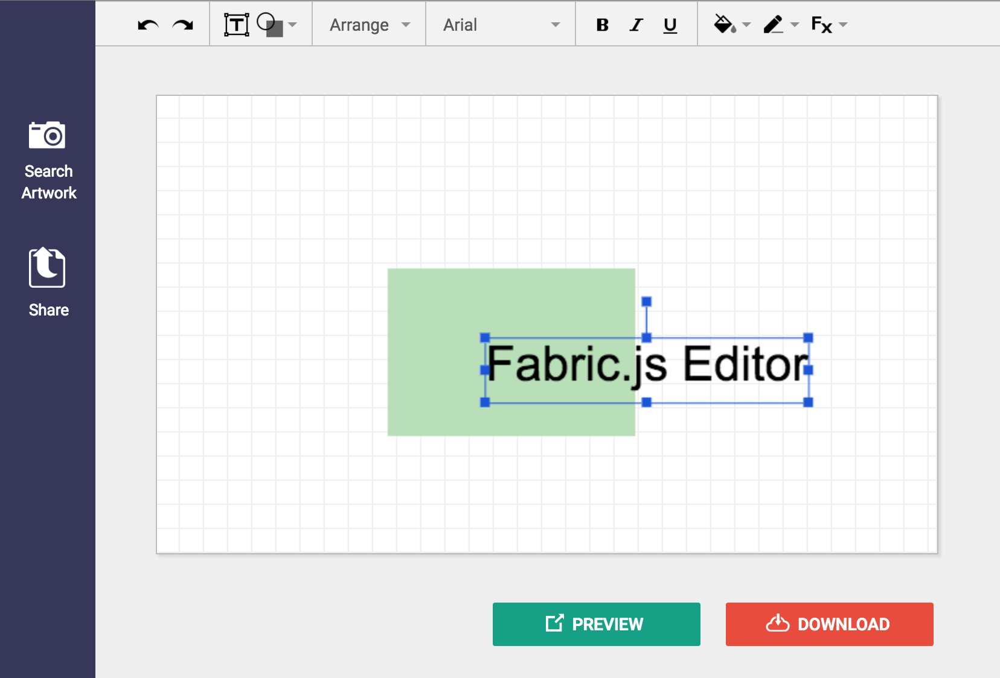

# Fabric.js Editor

A 100% web-based vector image editor that uses the HTML5 canvas element and [Fabric.js](http://fabricjs.com/)

## Running the code

	npm install
	gulp dev

If you run `gulp` without any arguments, you can see a list of the other tasks.

## Screenshots

## TODO's

* Switch to [gToolbars.js](https://github.com/danielktaylor/gToolbars.js), which is based on this project, for the toolbars
* Strip out some remaining code that talks to the (no longer existing) backend server
